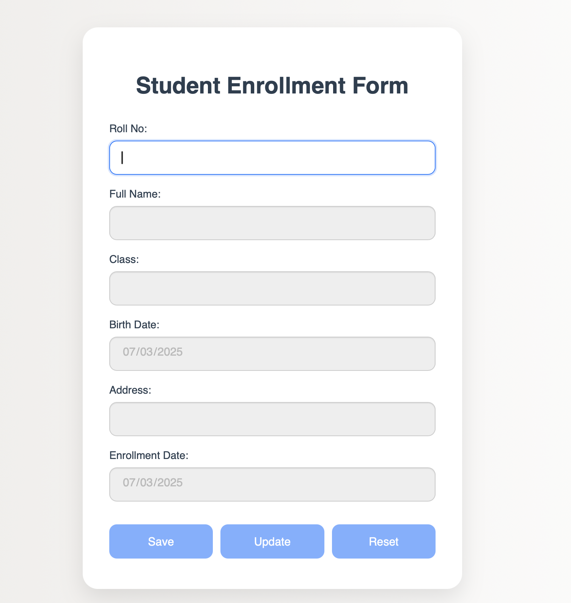
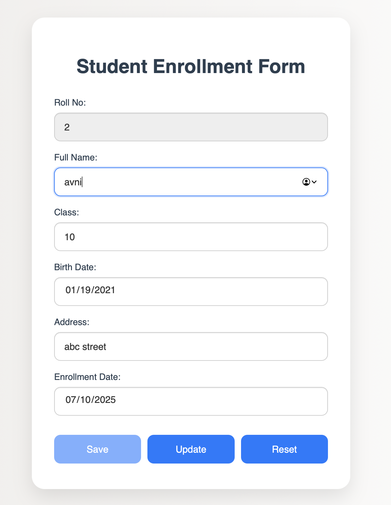
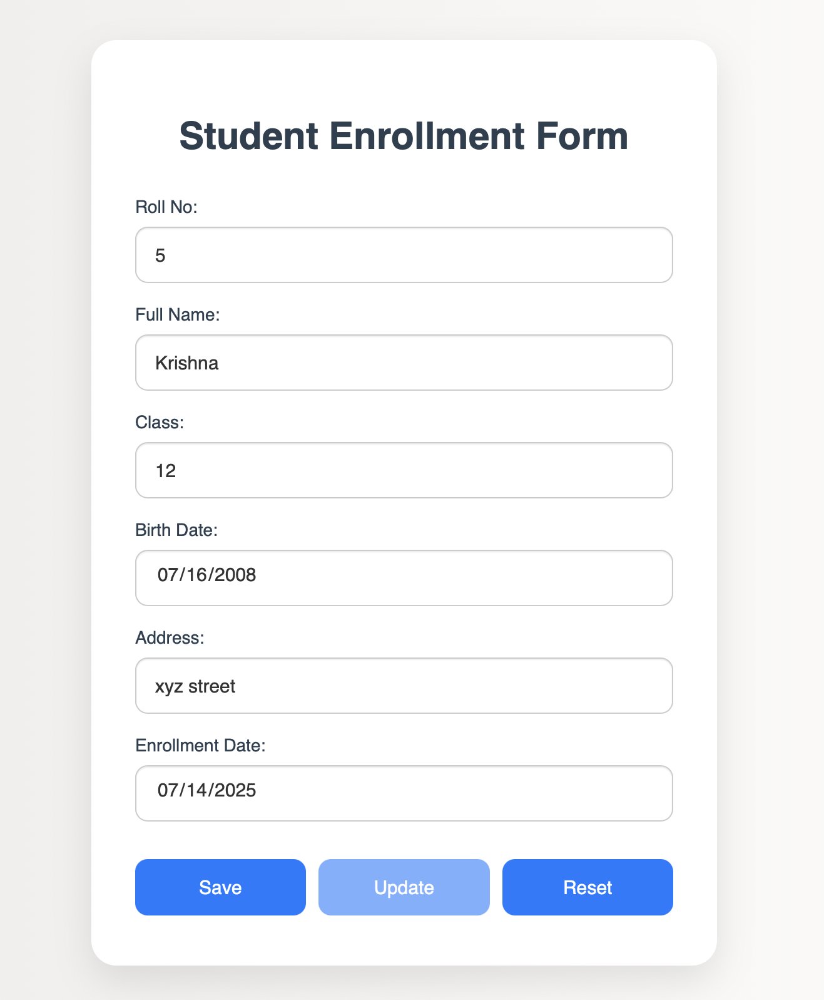

# Student Enrollment Form using JsonPowerDB

## Table of Contents

- [Project Description](#project-description)
- [Benefits of using JsonPowerDB](#benefits-of-using-jsonpowerdb)
- [Features](#features)
- [Scope of Functionalities](#scope-of-functionalities)
- [Illustrations](#illustrations)
- [Release History](#release-history)
- [Project Status](#project-status)
- [Sources](#sources)
- [Additional Information](#additional-information)
- [Deployment Notes](#deployment-notes)
- [Contributions](#contributions)

---

## Project Description

This project is a web-based **Student Enrollment Form** built using HTML, CSS, JavaScript, and JsonPowerDB. The application allows users to enter and store student information such as Roll Number, Full Name, Class, Date of Birth, Address, and Enrollment Date.

The primary key is the **Roll Number**. On entering a roll number, the form detects whether it already exists in the database:

- If not found, the form enables the user to **Save** a new record.
- If found, it fills in the existing data and enables the user to **Update** the record.

---

## Benefits of using JsonPowerDB

- No schema definition required
- Fast and lightweight
- REST API-based backend
- Secure data storage and retrieval

---

## Features

- Dynamic form validation
- Roll Number-based record lookup
- Save new student entries
- Update existing student records
- Reset form to initial state

---

## Scope of Functionalities

| Feature         | Description                          |
| --------------- | ------------------------------------ |
| Page Load       | Only Roll No. enabled; rest disabled |
| New Record      | Enables inputs and Save              |
| Existing Record | Fills form; enables Update           |
| Reset           | Clears and disables form             |
| Validation      | Blocks empty submissions             |

---

## Illustrations

---

## Release History

- **v1.0** – Initial version with Save, Update, and Reset functionality.

---

## Project Status

The project is fully functional with core features like primary key handling, Save/Update operations, and field control logic. Future improvements may include delete functionality, enhanced validations, and UI/UX refinements.

---

## Sources

- JsonPowerDB Documentation: https://login2explore.com/jpdb/docs.html
- Bootstrap: https://getbootstrap.com/

---

## Additional Information

- This project is created as a part of a micro project assignment.
- It demonstrates form handling, API interaction, and frontend logic.

---
## Deployment Notes

This project uses JsonPowerDB, which currently operates over HTTP only. However, GitHub Pages enforces HTTPS by default.

### As a result:
- The deployed version of this project on GitHub Pages does not function correctly due to blocked HTTP API requests.
- Users may see a 404 error or browser warnings about mixed content when trying to use the live version.

### How to test the project locally:
1. Clone or download the repository to your local machine.
2. Open the `index.html` file in any modern web browser.
3. The application will function correctly in a local environment.

### Recommendation:
To use this project in a live/hosted environment, consider one of the following:
- Use a backend that supports HTTPS.
- Set up a secure proxy to relay requests from HTTPS to HTTP safely.
---

### Contributions

Contributions are welcome! You can:

- Fork the repository
- Improve features like validations, UI/UX, or add new functionalities
- Submit a pull request with your enhancements
